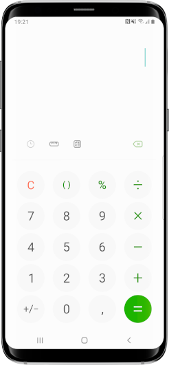

# Android system bars transparent

One of the difficulties that we have in firemonkey is to have more control of the system bars and this is so important for the design of the app that it should be done in a simple way via form properties, but as this is not yet possible I will teach here how to leave the system bars (status bar and navigation bar) background full transparent, including on the splash screen, to improve the design of the forms.

With this you can create beautiful apps, such as a calculator app with a completely white background:


## TAndroidSystemBars

In this repository you need to download the iPub.Android.SystemBars.pas, to access the structure TAndroidSystemBars:
  ```delphi
  TAndroidSystemBars = record
  public
    class function GetNavigationBarHeight: Single; static;
    class function GetStatusBarHeight: Single; static;
    class procedure SetSystemBarsBackground(AStatusBarColor, ANavigationBarColor: TAlphaColor); static;
  end;
  ```

#### TAndroidSystemBars.SetSystemBarsBackground

We will try to set the system bars (status bar and navigation bar) background full transparent (ignoring AStatusBarColor, ANavigationBarColor parameters) and set the app layout to cover the entire screen, that is, the form will expand to below the status bar and navigation bar. However in older android versions we don't have support to transparent status bar or transparent navigation bar, but some versions have the option to set an opaque color to system bars. When possible we will adjust automatically the light of system bars content (system bars foreground color) checking the brightness of AStatusBarColor and ANavigationBarColor to set the dark or light foreground.

Notes: 
  1) don't use this before the OnCreate of main form
  2) you need to call GetStatusBarHeight and GetNavigationBarHeight to get the system bars height to set the padding in your form to avoid some controls like TEdit or TButton to go below the system bar;

Example:

  ```delphi
  uses
    iPub.Android.SystemBars;
  
  procedure TForm1.FormCreate(Sender: TObject);
  begin
    Fill.Kind := TBrushKind.Solid;
    Fill.Color := TAlphaColors.White;
    TAndroidSystemBars.SetSystemBarsBackground(TAlphaColors.White, TAlphaColors.White);
  end;
  ```

#### TAndroidSystemBars.GetStatusBarHeight and TAndroidSystemBars.GetNavigationBarHeight

After call the "SetSystemBarsBackground" your form will expand to below the system bars, then you will need to call the GetStatusBarHeight and GetNavigationBarHeight to set the form padding to ajust the controls align of your form to don't go below the system bars (for example, one TButton with align top). Example:

  ```delphi
  uses
    iPub.Android.SystemBars;
  
  procedure TForm1.FormCreate(Sender: TObject);
  begin
    Fill.Kind := TBrushKind.Solid;
    Fill.Color := TAlphaColors.White;
    TAndroidSystemBars.SetSystemBarsBackground(TAlphaColors.White, TAlphaColors.White);
	Form1.Padding.Top := TAndroidSystemBars.GetStatusBarHeight;
	Form1.Padding.Bottom := TAndroidSystemBars.GetNavigationBarHeight;
  end;
  ```
  
## Splash screen - System bars and background

The class TAndroidSystemBars is just to use in runtime, after the application full launch. But if you don't change the default "styles.xml" and "splash_image_def.xml" provided by Delphi, you will have an ugly system bars or simply not predictable (some devices may be white, others black or even gray), and the splash screen background will be always black. To fix the system bars colors and background color of splash screen you should change the "styles.xml" and "splash_image_def.xml" files.

#### Creating "styles.xml"

Create one file called "styles.xml" with the following content:

  ```xml
  <resources xmlns:android="http://schemas.android.com/apk/res/android">
      <style name="AppTheme" parent="@android:style/Theme.Material.Light.NoActionBar">
          <item name="android:navigationBarColor">#01ffffff</item>
          <item name="android:statusBarColor">#00000000</item>
          <item name="android:colorPrimary">#ffffff</item>
          <item name="android:windowBackground">@drawable/splash_image_def</item>
      </style>
  </resources>
  ```

In this content above I used the white color example (#ffffff) but you can change it to your color but note that in navigationBarColor the color need to start with "#01" to set the alpha value to 1 to solve problems found in LG devices

Save the file in one subdirectory of your project, like "resources" subdirectory, for example.

#### Creating "splash_image_def.xml"

Create one file called "splash_image_def.xml" with the following content:

  ```xml
  <?xml version="1.0" encoding="utf-8"?>
  <layer-list xmlns:android="http://schemas.android.com/apk/res/android">
    <item>
      <shape android:shape="rectangle">
        <solid android:color="#ffffff" />
      </shape>
    </item>
    <item>
      <bitmap android:gravity="center" android:src="@drawable/splash_image" />
    </item>
  </layer-list>
  ```

In this content above I used one white color example (#ffffff) but you can change it to your color.

Save the file in one subdirectory of your project, like "resources" subdirectory, for example.

#### Deploying the "styles.xml" and "splash_image_def.xml"

 1) Open your Project > Deployment
 2) Add your own "styles.xml" file and set the Remote Path field to "res\values"
 3) Add your own "splash_image_def.xml" file and set the Remote Path field to "res\drawable"

Now you can uninstall your app, compile and run to see the difference ;)

## Compatibility

I made some tests with Delphi Sydney 10.4.1 running the app in some devices:

    LG      - LM-X430 Android32 10.0.0 (API level 29)
    SAMSUNG - SM-G955F Android64 9.0.0 (API level 28)
    SAMSUNG - SM-G935F Android64 8.0.0 (API level 26)

All worked perfectly. But these codes should work well on all android versions supported by delphi (Android 6 to Android 11).